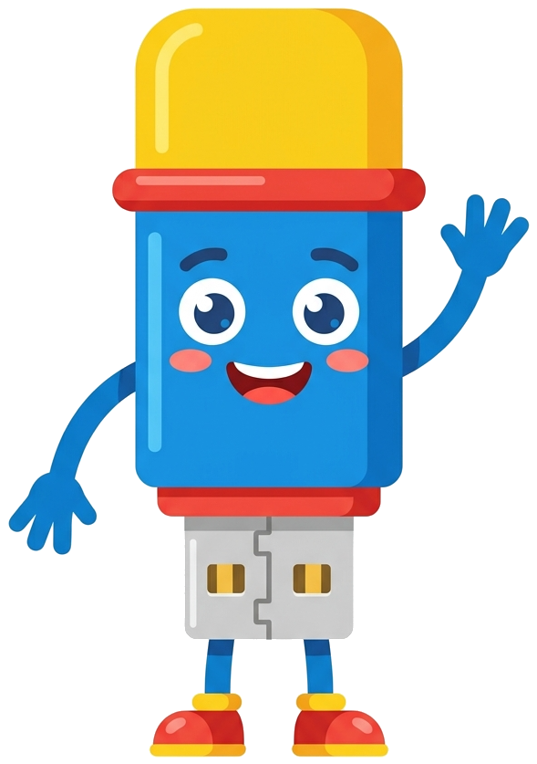

<div align="center">



# USBuddy

**Your AI on a USB stick. Plug in. Chat. Unplug.**

[Architecture](docs/ARCHITECTURE.md) ·
[Catalog spec](docs/CATALOG-SPEC.md) ·
[Footprint](docs/FOOTPRINT.md) ·
[Verification](docs/VERIFICATION.md)

</div>

---

USBuddy is a self-contained local LLM that runs entirely from a USB
drive. The model, the inference engine, the chat UI, and the wrapper
that ties them together all live on the stick. Plug it into any
reasonably modern Mac, Linux, or Windows machine and you get a private
ChatGPT-style chat window on `localhost`. Unplug and walk away — the
host keeps no model, no chat history, no service, no scheduled task.

There is no telemetry, no auto-update, no cloud account, no daemon. The
chat UI is a static SPA in your default browser. The engine is
`llama.cpp`. The wrapper is a single small Rust binary. That's the
entire stack.

## Quickstart

```sh
git clone https://github.com/skullzarmy/USBuddy.git
cd USBuddy
cargo build --release --workspace
cargo run -p usbuddy-installer-gui
```

The installer GUI prepares a real USB drive or any folder you point it
at. Once it's done, double-click `USBuddy.command` / `.bat` / `.sh` at
the drive's root and the chat UI opens in your browser at
`http://127.0.0.1:8765`.

CLI and TUI installers are also available (`usbuddy-installer-cli`,
`usbuddy-installer-tui`) — same Rust core, different surface.

## Requirements

64-bit macOS, Linux, or Windows. 16 GB RAM for a 7-8B Q4 model; 32 GB
for headroom. A USB 3.0+ stick with ~10 GB free, formatted exFAT. CPU
inference works everywhere; Metal / CUDA / Vulkan / ROCm are used
automatically when present.

The first time you launch an unsigned binary on macOS or Windows you'll
need to dismiss Gatekeeper or SmartScreen. There's no Apple Developer
ID or Authenticode cert in scope; release artifacts are verified via
SHA256SUMS, a CycloneDX SBOM, and SLSA build provenance attestations
instead. See [docs/VERIFICATION.md](docs/VERIFICATION.md).

## How it works

Two programs sharing one Rust core. The **installer** runs once on a
host to format, populate, and update the drive. The **runtime** runs
ephemerally from the drive on whatever host you plug into. The runtime
serves a static SPA from RAM, spawns `llama-server` against a model on
the drive, idle-unloads after 5 minutes, and shuts down cleanly on
quit. Every drive write is atomic and yank-survivable. Model integrity
is verified against the catalog's `sha256` on every launch.

Full design rationale, threat model, and the stacks ruled out and why
are in [docs/ARCHITECTURE.md](docs/ARCHITECTURE.md).

## Models

USBuddy ships a curated catalog covering Qwen 2.5 7B Instruct, Mistral
7B v0.3, Llama 3.1 8B (gated), Qwen 2.5 Coder 7B, and Dolphin 2.9.4.
Drop any `.gguf` into the drive's `models/` directory and it's
discovered as a community model. Catalog schema and content profiles
are in [docs/CATALOG-SPEC.md](docs/CATALOG-SPEC.md).

The RAM-fit advisor reads each model's actual KV-cache shape from its
GGUF header and refuses to load anything that would spill to disk —
the #1 way local LLMs leak weights to the host.

## Status

Pre-release. Build from source; tagged releases will appear on the
[Releases page](https://github.com/skullzarmy/USBuddy/releases) when
ready.

## Development

```sh
cargo fmt --all
cargo clippy --workspace --all-targets -- -D warnings
cargo test --workspace
```

Project conventions and workspace layout are in
[CLAUDE.md](CLAUDE.md). The web UI under `ui/web/` is a React + Vite SPA
whose built bundle (`ui/web/dist/`, committed) is embedded into the
runtime binary via `include_str!` — `cargo build` already bundles it.
After changing UI sources, run `npm --prefix ui/web run build` to
regenerate the bundle.

## License

[Apache-2.0](LICENSE). See [NOTICE](NOTICE) for upstream attribution.
